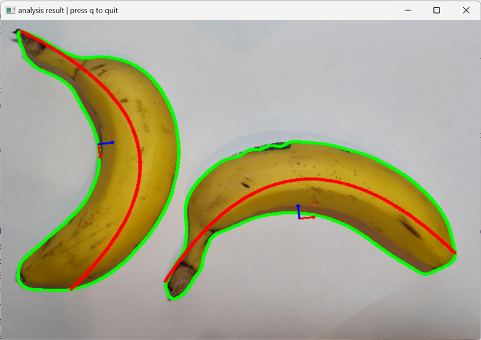

# Banana Project

This is a mini-project for the image processing course of the [FHGR B.Sc. Mobile Robotics](https://fhgr.ch/mr),
implemented by [Dominic Eicher](https://github.com/Nic822) and [Ralph Ursprung](https://github.com/rursprung).

This project analyses pictures of bananas to try and identify some information about them (e.g. their ripeness).
Note that we will currently only support [Cavendish Bananas](https://en.wikipedia.org/wiki/Cavendish_banana)
(_the_ standard banana) as others may exhibit other properties (e.g. [cooking bananas](https://en.wikipedia.org/wiki/Cooking_banana)
are green even when ripe).

Note that this implementation does _not_ rely on any machine learning algorithms and instead employs traditional
image processing steps.

## Project Structure

The project consists of a library implementing the actual functionality and two applications, one feeding the library
with live pictures from an attached camera and one feeding it static images (mainly for manual testing).
Additionally, the 2D polyfitting library has been split into its own library as it is separate from the rest.

## Building

To build this project you will need:

* A modern C++ compiler supporting C++23
* [CMake](https://cmake.org/) incl. CTest - this might well come included with your favourite IDE
* [vcpkg](https://vcpkg.io/)

## Sample Output

Here is an example of the application processing an image with two bananas on it:


Additionally, the following output is generated on the console, offering further information:
```
found 2 banana(s) in the picture
  Banana #0:
    y = 1968.704538 -2.818917 * x +0.001434 * x^2
    Rotation = -6.42 degrees
    Mean curvature = 0.21 1/cm (corresponds to a circle with radius = 4.76 cm)
    Length along center line = 9.59 cm
    ripeness = 103 %

  Banana #1:
    y = 493.926139 -0.944471 * x +0.001329 * x^2
    Rotation = 81.35 degrees
    Mean curvature = 0.20 1/cm (corresponds to a circle with radius = 4.92 cm)
    Length along center line = 9.46 cm
    ripeness = 104 %
```

## License
As this is purely an educational project there's no need for others to include it in their commercial works.
Accordingly, this is licensed under the **GNU General Public License v3.0 or later** (SPDX: `GPL-3.0-or-later`).
See [LICENSE](LICENSE) for the full license text.
